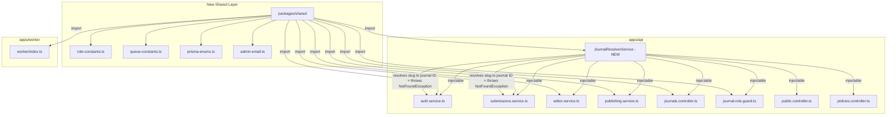

# High-Severity Architecture Fixes — Implementation Plan

## Problem Summary

Three high-severity duplication issues plague the API layer, creating maintenance burden and inconsistency risk:

1. **Journal slug → ID resolution** duplicated 23 times across controllers, services, and guards
2. **Role constant arrays** (`EDITOR_ROLES`, `MFA_REQUIRED_ROLES`, etc.) duplicated in 3+ service files
3. **Hardcoded admin email** (`"amit.rai@celnet.in"`) duplicated in 3 files, should be an env var

These are compounded by two supporting issues:
- **Prisma enum runtime workaround** duplicated in 5+ files
- **Queue constants** duplicated between `apps/api` and `apps/worker`

---

## Architecture Overview



---

## Fix 1: Journal Slug Resolution — `JournalResolverService`

### Current Problem

Every method that receives a `journalSlug` param repeats this pattern:

```typescript
const journal = await this.prisma.journal.findFirst({
  where: { slug: journalSlug },
  select: { id: true }  // sometimes more fields
});
if (!journal) throw new NotFoundException("Journal not found");
```

This appears **23 times** across:
- [`journals.controller.ts`](apps/api/src/modules/journals/journals.controller.ts) — ~10 occurrences
- [`editor.service.ts`](apps/api/src/modules/editor/editor.service.ts) — 2 occurrences
- [`publishing.service.ts`](apps/api/src/modules/publishing/publishing.service.ts) — 5 occurrences
- [`submissions.service.ts`](apps/api/src/modules/submissions/submissions.service.ts) — 2 occurrences
- [`journal-role.guard.ts`](apps/api/src/modules/auth/journal-role.guard.ts) — 1 occurrence
- [`public.controller.ts`](apps/api/src/modules/public/public.controller.ts) — 3 occurrences
- [`policies.controller.ts`](apps/api/src/modules/policies/policies.controller.ts) — 3 occurrences

### Solution

Create a NestJS injectable `JournalResolverService` that:

1. Resolves `journalSlug` → `{ id, slug }` (the minimum fields every consumer needs)
2. Throws `NotFoundException("Journal not found")` if not found
3. Supports optional `select` parameter for consumers that need more fields
4. Is provided globally via a `JournalResolverModule`

```typescript
// apps/api/src/modules/journal-resolver/journal-resolver.service.ts
@Injectable()
export class JournalResolverService {
  constructor(@Inject(PrismaService) private readonly prisma: PrismaService) {}

  /** Resolve slug to journal ID. Throws NotFoundException if not found. */
  async resolveSlug(
    journalSlug: string,
    select?: Prisma.JournalSelect
  ): Promise<{ id: string; slug: string }> {
    const journal = await this.prisma.journal.findFirst({
      where: { slug: journalSlug },
      select: select ?? { id: true, slug: true },
    });
    if (!journal) throw new NotFoundException("Journal not found");
    return journal as { id: string; slug: string };
  }

  /** Resolve slug with optional status filter (e.g., only LIVE journals for public routes). */
  async resolveSlugWithStatus(
    journalSlug: string,
    status: JournalStatus,
    select?: Prisma.JournalSelect
  ): Promise<{ id: string; slug: string }> {
    const journal = await this.prisma.journal.findFirst({
      where: { slug: journalSlug, status },
      select: select ?? { id: true, slug: true },
    });
    if (!journal) throw new NotFoundException("Journal not found");
    return journal as { id: string; slug: string };
  }
}
```

### Files to Create

| File | Purpose |
|------|---------|
| `apps/api/src/modules/journal-resolver/journal-resolver.service.ts` | The service class |
| `apps/api/src/modules/journal-resolver/journal-resolver.module.ts` | NestJS module (provides PrismaService, exports service) |

### Files to Modify

Replace all 23 `journal.findFirst({ where: { slug } })` + `NotFoundException` blocks with `this.journalResolver.resolveSlug(journalSlug)` (or `resolveSlugWithStatus` for public routes).

| File | Occurrences to Replace |
|------|------------------------|
| [`journals.controller.ts`](apps/api/src/modules/journals/journals.controller.ts) | ~10 |
| [`editor.service.ts`](apps/api/src/modules/editor/editor.service.ts) | 2 |
| [`publishing.service.ts`](apps/api/src/modules/publishing/publishing.service.ts) | 5 |
| [`submissions.service.ts`](apps/api/src/modules/submissions/submissions.service.ts) | 2 |
| [`journal-role.guard.ts`](apps/api/src/modules/auth/journal-role.guard.ts) | 1 |
| [`public.controller.ts`](apps/api/src/modules/public/public.controller.ts) | 3 |
| [`policies.controller.ts`](apps/api/src/modules/policies/policies.controller.ts) | 3 |

---

## Fix 2: Centralized Role Constants via `packages/shared`

### Current Problem

Role arrays are defined independently in multiple files:

| Constant | Defined In | Values |
|----------|-----------|--------|
| `EDITOR_ROLES` | [`editor.service.ts`](apps/api/src/modules/editor/editor.service.ts:19), [`publishing.service.ts`](apps/api/src/modules/publishing/publishing.service.ts:12) | JOURNAL_ADMIN, EDITOR_IN_CHIEF, MANAGING_EDITOR, SECTION_EDITOR, ASSOCIATE_EDITOR |
| `MFA_REQUIRED_ROLES` | [`auth.service.ts`](apps/api/src/modules/auth/auth.service.ts:19) | Same as EDITOR_ROLES + COPYEDITOR + PRODUCTION_EDITOR |
| `EDITORIAL_ROLES` | [`auth.service.ts`](apps/api/src/modules/auth/auth.service.ts:28) | Same as MFA_REQUIRED_ROLES |
| `MANAGEMENT_ROLES` | [`auth.service.ts`](apps/api/src/modules/auth/auth.service.ts:37) | JOURNAL_ADMIN, EDITOR_IN_CHIEF, MANAGING_EDITOR |
| `SETTINGS_ROLES` | [`journals.controller.ts`](apps/api/src/modules/journals/journals.controller.ts:47) | Likely same as MANAGEMENT_ROLES |

### Solution

Create `packages/shared/src/role-constants.ts` that exports these arrays using the centralized Prisma enum accessor:

```typescript
// packages/shared/src/role-constants.ts
import { prismaEnum } from "./prisma-enums.js";

/** Roles that can perform editorial actions on submissions. */
export const EDITOR_ROLES = [
  prismaEnum.JournalRole.JOURNAL_ADMIN,
  prismaEnum.JournalRole.EDITOR_IN_CHIEF,
  prismaEnum.JournalRole.MANAGING_EDITOR,
  prismaEnum.JournalRole.SECTION_EDITOR,
  prismaEnum.JournalRole.ASSOCIATE_EDITOR,
];

/** Roles required to set up MFA. */
export const MFA_REQUIRED_ROLES = [
  ...EDITOR_ROLES,
  prismaEnum.JournalRole.COPYEDITOR,
  prismaEnum.JournalRole.PRODUCTION_EDITOR,
];

/** Roles considered editorial staff. */
export const EDITORIAL_ROLES = MFA_REQUIRED_ROLES;

/** Roles with journal-level management privileges. */
export const MANAGEMENT_ROLES = [
  prismaEnum.JournalRole.JOURNAL_ADMIN,
  prismaEnum.JournalRole.EDITOR_IN_CHIEF,
  prismaEnum.JournalRole.MANAGING_EDITOR,
];

/** Roles for journal settings/configuration. */
export const SETTINGS_ROLES = MANAGEMENT_ROLES;
```

### Files to Modify

| File | Change |
|------|--------|
| [`editor.service.ts`](apps/api/src/modules/editor/editor.service.ts) | Remove local `EDITOR_ROLES`, import from `@pub/shared` |
| [`publishing.service.ts`](apps/api/src/modules/publishing/publishing.service.ts) | Remove local `EDITOR_ROLES`, import from `@pub/shared` |
| [`auth.service.ts`](apps/api/src/modules/auth/auth.service.ts) | Remove `MFA_REQUIRED_ROLES`, `EDITORIAL_ROLES`, `MANAGEMENT_ROLES`, import from `@pub/shared` |
| [`journals.controller.ts`](apps/api/src/modules/journals/journals.controller.ts) | Remove `SETTINGS_ROLES`, import from `@pub/shared` |

---

## Fix 3: Hardcoded Admin Email → Environment Variable

### Current Problem

`DEFAULT_GOOGLE_ADMIN_EMAIL = "amit.rai@celnet.in"` is hardcoded in 3 files:

- [`auth.service.ts`](apps/api/src/modules/auth/auth.service.ts:10) — used in `isDefaultAdminEmail()` and `ensureDefaultAdminAccess()`
- [`journal-role.guard.ts`](apps/api/src/modules/auth/journal-role.guard.ts:9) — used for super-admin bypass
- [`journals.controller.ts`](apps/api/src/modules/journals/journals.controller.ts:25) — used in `isDefaultAdminEmail()` and direct DB lookups

### Solution

1. Add `DEFAULT_ADMIN_EMAIL` to `.env.example` and NestJS config
2. Create a shared utility in `packages/shared` that reads from env
3. Replace all 3 hardcoded values

```typescript
// packages/shared/src/admin-email.ts
/** Returns the default admin email from env, or empty string if not set. */
export function getDefaultAdminEmail(): string {
  return (process.env.DEFAULT_ADMIN_EMAIL ?? "").trim().toLowerCase();
}

/** Checks if the given email matches the default admin. */
export function isDefaultAdminEmail(email: string | null | undefined): boolean {
  return (email ?? "").trim().toLowerCase() === getDefaultAdminEmail();
}
```

### Files to Modify

| File | Change |
|------|--------|
| [`.env.example`](/.env.example) | Add `DEFAULT_ADMIN_EMAIL=amit.rai@celnet.in` |
| [`auth.service.ts`](apps/api/src/modules/auth/auth.service.ts) | Remove `DEFAULT_GOOGLE_ADMIN_EMAIL` constant and `isDefaultAdminEmail()` method, import `isDefaultAdminEmail` from `@pub/shared` |
| [`journal-role.guard.ts`](apps/api/src/modules/auth/journal-role.guard.ts) | Remove `DEFAULT_GOOGLE_ADMIN_EMAIL` constant, import `isDefaultAdminEmail` from `@pub/shared` |
| [`journals.controller.ts`](apps/api/src/modules/journals/journals.controller.ts) | Remove `DEFAULT_GOOGLE_ADMIN_EMAIL` constant and `isDefaultAdminEmail()` method, import `isDefaultAdminEmail` from `@pub/shared` |

---

## Supporting Fix A: Prisma Enum Runtime Accessor

### Current Problem

The workaround pattern `const { JournalRole } = prismaClient as { JournalRole: typeof import("@prisma/client").JournalRole }` is repeated in 5+ files because Prisma generates enums at runtime and TypeScript cannot import them as values directly in ESM mode.

### Solution

Create a single centralized accessor in `packages/shared`:

```typescript
// packages/shared/src/prisma-enums.ts
import * as prismaClient from "@prisma/client";

/** Centralized runtime accessor for Prisma enums. 
 *  Prisma generates enums at runtime; TypeScript ESM mode 
 *  cannot import them as values directly. */
export const prismaEnum = prismaClient as unknown as {
  JournalRole: typeof import("@prisma/client").JournalRole;
  SubmissionStatus: typeof import("@prisma/client").SubmissionStatus;
  ReviewAssignmentStatus: typeof import("@prisma/client").ReviewAssignmentStatus;
  ReviewRecommendation: typeof import("@prisma/client").ReviewRecommendation;
  DecisionType: typeof import("@prisma/client").DecisionType;
  EditorAssignmentRole: typeof import("@prisma/client").EditorAssignmentRole;
  ArticleStatus: typeof import("@prisma/client").ArticleStatus;
  IssueStatus: typeof import("@prisma/client").IssueStatus;
  ArticleAccess: typeof import("@prisma/client").ArticleAccess;
  StorageProvider: typeof import("@prisma/client").StorageProvider;
  StorageTarget: typeof import("@prisma/client").StorageTarget;
  DataSyncRunStatus: typeof import("@prisma/client").DataSyncRunStatus;
  MessageDeliveryStatus: typeof import("@prisma/client").MessageDeliveryStatus;
  FileSetKind: typeof import("@prisma/client").FileSetKind;
  StoredFileRole: typeof import("@prisma/client").StoredFileRole;
  JournalStatus: typeof import("@prisma/client").JournalStatus;
  UserStatus: typeof import("@prisma/client").UserStatus;
  PolicyContext: typeof import("@prisma/client").PolicyContext;
  ReviewModel: typeof import("@prisma/client").ReviewModel;
};
```

### Files to Modify

| File | Change |
|------|--------|
| [`auth.service.ts`](apps/api/src/modules/auth/auth.service.ts) | Remove local `const { JournalRole } = prismaClient as ...`, use `prismaEnum.JournalRole` |
| [`submissions.service.ts`](apps/api/src/modules/submissions/submissions.service.ts) | Remove local enum destructuring, use `prismaEnum.SubmissionStatus` etc. |
| [`editor.service.ts`](apps/api/src/modules/editor/editor.service.ts) | Remove local enum destructuring, use `prismaEnum.*` |
| [`publishing.service.ts`](apps/api/src/modules/publishing/publishing.service.ts) | Remove local enum destructuring, use `prismaEnum.*` |
| [`journal-role.guard.ts`](apps/api/src/modules/auth/journal-role.guard.ts) | Remove local enum destructuring, use `prismaEnum.*` |
| [`journals.controller.ts`](apps/api/src/modules/journals/journals.controller.ts) | Remove local enum destructuring, use `prismaEnum.*` |
| [`reviewer.service.ts`](apps/api/src/modules/reviewer/reviewer.service.ts) | Remove local enum destructuring, use `prismaEnum.*` |

---

## Supporting Fix B: Queue Constants Unification

### Current Problem

`QUEUE_EMAIL = "email"` and `EmailJob` type are defined separately in:
- [`apps/worker/src/queues.ts`](apps/worker/src/queues.ts)
- [`apps/api/src/modules/queues/queues.service.ts`](apps/api/src/modules/queues/queues.service.ts)

### Solution

Move both to `packages/shared/src/queue-constants.ts`:

```typescript
// packages/shared/src/queue-constants.ts
export const QUEUE_EMAIL = "email";

export type EmailJob = {
  to: string[];
  subject: string;
  html: string;
};
```

### Files to Modify

| File | Change |
|------|--------|
| [`apps/worker/src/queues.ts`](apps/worker/src/queues.ts) | Remove local `QUEUE_EMAIL` and `EmailJob`, import from `@pub/shared` |
| [`apps/worker/src/index.ts`](apps/worker/src/index.ts) | Update import source |
| [`apps/api/src/modules/queues/queues.service.ts`](apps/api/src/modules/queues/queues.service.ts) | Remove local `QUEUE_EMAIL` and `EmailJob`, import from `@pub/shared` |

---

## New Package: `packages/shared`

### Package Structure

```
packages/shared/
  package.json          # name: "@pub/shared", main: "dist/index.js", types: "dist/index.d.ts"
  tsconfig.json         # extends from root, outDir: "dist"
  src/
    index.ts            # barrel export
    prisma-enums.ts     # centralized Prisma enum runtime accessor
    role-constants.ts   # EDITOR_ROLES, MFA_REQUIRED_ROLES, etc.
    admin-email.ts      # getDefaultAdminEmail(), isDefaultAdminEmail()
    queue-constants.ts  # QUEUE_EMAIL, EmailJob type
```

### Dependency Chain

`@pub/shared` depends on `@prisma/client` (already in workspace). Both `apps/api` and `apps/worker` will depend on `@pub/shared`.

### pnpm-workspace.yaml Update

Already has `packages/*` — no change needed if we place it under `packages/shared`.

---

## Execution Order

The steps should be executed in this order to avoid broken imports at any intermediate state:

1. **Create `packages/shared`** — scaffold, `package.json`, `tsconfig.json`, all source files
2. **Add `@pub/shared` dependency** to `apps/api/package.json` and `apps/worker/package.json`
3. **Run `pnpm install`** — links the new workspace package
4. **Replace hardcoded admin email** — smallest, most isolated change; update `.env.example` + 3 consumer files
5. **Replace Prisma enum pattern** — import `prismaEnum` from `@pub/shared` in all 7 consumer files
6. **Replace role constants** — import from `@pub/shared` in all 4 consumer files
7. **Replace queue constants** — import from `@pub/shared` in worker + API
8. **Create `JournalResolverService`** — new module in `apps/api`
9. **Register `JournalResolverModule`** in [`app.module.ts`](apps/api/src/modules/app.module.ts)
10. **Replace all 23 journal slug resolution calls** — inject `JournalResolverService` in each consumer
11. **Inject `JournalResolverService`** into services that currently take only `PrismaService`
12. **Run `pnpm typecheck`** — verify no type errors
13. **Run `pnpm test`** — verify no test regressions

---

## Risk Mitigation

| Risk | Mitigation |
|------|-----------|
| Circular dependency between `@pub/shared` and `@prisma/client` | `@pub/shared` only imports `@prisma/client` as a namespace — no circular risk |
| `JournalResolverService` changes behavior for public routes that filter by `status: LIVE` | Provide both `resolveSlug()` and `resolveSlugWithStatus()` methods |
| Admin email env var not set in production | `getDefaultAdminEmail()` returns empty string when env var is absent, which effectively disables the super-admin bypass — document this clearly in `.env.example` |
| Existing tests break due to import path changes | All imports use workspace package name `@pub/shared`, resolved by pnpm — no relative path changes needed |

---

## Files Changed Summary

### New Files (4)
- `packages/shared/package.json`
- `packages/shared/tsconfig.json`
- `packages/shared/src/index.ts` (barrel)
- `packages/shared/src/prisma-enums.ts`, `role-constants.ts`, `admin-email.ts`, `queue-constants.ts`
- `apps/api/src/modules/journal-resolver/journal-resolver.service.ts`
- `apps/api/src/modules/journal-resolver/journal-resolver.module.ts`

### Modified Files (15)
- `.env.example` — add `DEFAULT_ADMIN_EMAIL`
- `pnpm-workspace.yaml` — verify `packages/*` coverage (likely already correct)
- `apps/api/package.json` — add `@pub/shared` dependency
- `apps/worker/package.json` — add `@pub/shared` dependency
- `apps/api/src/modules/app.module.ts` — import `JournalResolverModule`
- `apps/api/src/modules/auth/auth.service.ts` — 4 changes (admin email, role constants, prisma enums, journal resolver)
- `apps/api/src/modules/auth/journal-role.guard.ts` — 3 changes (admin email, prisma enums, journal resolver)
- `apps/api/src/modules/journals/journals.controller.ts` — 4 changes (admin email, role constants, prisma enums, journal resolver)
- `apps/api/src/modules/submissions/submissions.service.ts` — 2 changes (prisma enums, journal resolver)
- `apps/api/src/modules/editor/editor.service.ts` — 3 changes (role constants, prisma enums, journal resolver)
- `apps/api/src/modules/reviewer/reviewer.service.ts` — 1 change (prisma enums)
- `apps/api/src/modules/publishing/publishing.service.ts` — 3 changes (role constants, prisma enums, journal resolver)
- `apps/api/src/modules/public/public.controller.ts` — 1 change (journal resolver)
- `apps/api/src/modules/policies/policies.controller.ts` — 1 change (journal resolver)
- `apps/worker/src/queues.ts` — 1 change (queue constants)
- `apps/worker/src/index.ts` — 1 change (queue constants import source)
- `apps/api/src/modules/queues/queues.service.ts` — 1 change (queue constants)